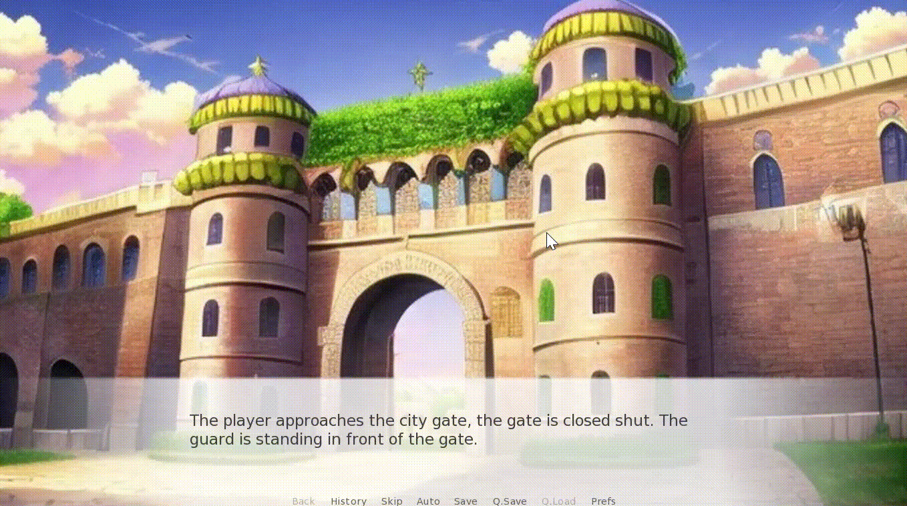

# Dejavu: ChatGPT (or other Large Language Model LLM) in your Ren'Py visual novel with prescripted script.

*Ren'Py-like natural language with full rollback/SaveLoad support!*

## Introduction

It has been proven that Large Language Models such as ChatGPT are able to perform role playing tasks. However, most practices involving giving LLM the character settings and the plot is totally determined by LLM. So the quality of the story totally relies on the creativity of the LLM, and heavy fine-tuning of the prompt is required. 

Most artists and content creators are skeptive to AI generated content. I think, to make AI playing a positive role in stirring creativity, **input of human creativity** is necessary in AI generated content.

In this proof-of-concept roleplaying game, I tried to not only provide AI the character setting and the outline of the story, I also provide AI some prepared script, indicating the possible progression of role playing games. I call this method **"Dejavu"**. *The AI have Dejavu of what will happen.* since it had been lived the same scene multiple times, as in Endless Eight in Haruhi Suzumiya.

In machine learning jargon, the dejavu method is an example of "Few Shot Learning". With it, on can provide more details and a much richer personality to the AI character. Also It can prevent the conversation from being derailed.


## Example:



### Example Code (Ren'Py)

```py
# ...

# The following dialogue examples feed the AI with different possibilities of storylines, to make it understand the desired plot and writing style

example_dialogue "A bribe"

Adventurer "No worries, Captain. Here is the document"
Guard "Give me the letter, Adventurer. *impatiently* I don't have all day. "
call_incident "Examine Documents" ("The guard need to check the document to confirm what Adventurer says") # Here AI will learn to ask the game engine to provide information about the document
narrator_dejavu "Adventurer presents the party's documents to Captain Galen. The documents are signed and stamped by the proper authorities."
Guard "*examines the documents* Hmm... *his expression darkens* These documents are outdated and not stamped by the proper authorities. Entry denied."
Adventurer "Captain Galen, please reconsider! We come with urgent news from the nearby village of Glimmerbrook. A horde of undead is preparing to attack Eldoria."
Guard "*skeptical* Undead, you say? That's not an excuse to bypass the city's regulations."
Adventurer "*leaning forward* Listen, Captain, we understand the importance of security, but time is of the essence. Lives are at stake. Surely, there must be something we can do to gain entry?"
Guard "*crossing arms* I'm afraid not. Our rules are strict for a reason."
Adventurer "*sincerely* Captain Galen, please. We risked our lives to bring this information. Surely, the safety of the city is worth bending the rules a bit."
Guard "*stern* Rules are rules. If you can't abide by them, then leave."
Adventurer "Captain, we understand the importance of your duty. Would a little compensation help you look the other way, just this once?"
Guard "*raised eyebrow* Hugh? What are you implying? "
call_incident "Need Take Bribe" ("The guard need to receive the bribe to let the Adventurer pass.")
narrator_dejavu "Adventurer offers a pouch of gold to Captain Galen."
Guard "*hesitates, torn between duty and the gold.* Fine. But this better not come back to haunt me. *reluctantly* You have one day, and then you're out."
jump_outcome "Allow Enter" ("After receiving the bribe and examine the document, The guard allowed the player to enter the city") # AI will determine which outcome the player achieved!


# ...

label .take_item:
    $ item=renpy.input("(debug only) What item do you want to give? \"no\" for not giving anything, enter for more discussion",length=1000) # We need to check player's inventory in actual game!
    $ renpy.fix_rollback()
    if item=="no":
        narrator_dejavu "Adventurer refuses to give the item" # The Guard will get mad at that.
    elif item=="":
        narrator_dejavu "Adventurer tries to persuade the guard again."
    else:
        narrator_dejavu "Adventurer gives [item] to the guard"
        "You lose [item]!"
        # player.item--
    return

label .passed:
    "You successfully enter the city."
    "Good Ending"
    jump second_day

# ...
```

## How to install

copy renpy/The City Gate/game/dejavu_ren.py, to the same place of your project folder

view renpy/The City Gate/game/city_gate.rpy to learn the syntax of writing


## Issues and Limitations

- Incident check does not work as desired. Will think of a new mechanical to make AI want to verify factual information with the game system, like the player states, inventories, lores.


- ChatGPT will stuck for minutes when encountering sensitive content. Think about Isaac Asimov's "Three Laws of Robotics"!

To bypass the limitation that AI cannot actively attack user, one can let AI detect the condition which will make NPC decided to start a fight, and trigger the fighting scene using hard-coding
```py
outcome "Irritated" (label="city_gate.fight") # to bypass the safety check of ChatGPT, we need to hard coding the guard's attack behavior #But sometimes it will be triggered when undesired.
condition "The conflict escalates and the guard was totally irritated by the player."

outcome "Fight" (label="city_gate.fight") # if player actively decide to fight the guard, ChatGPT is still able to generate the guard's attack behavior
condition "The conflict escalates and the guard attacks the player."
```
